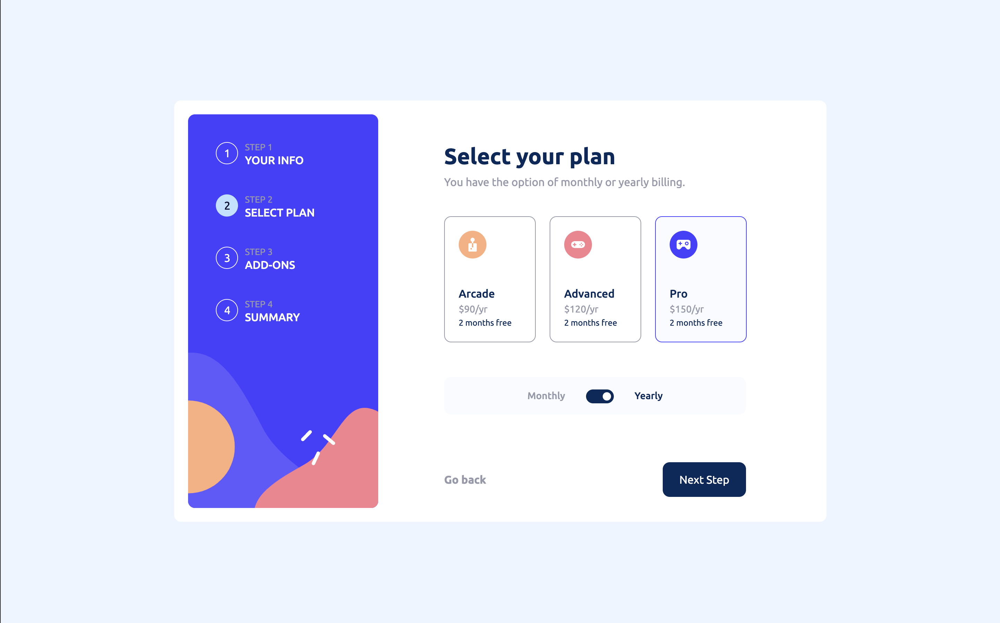
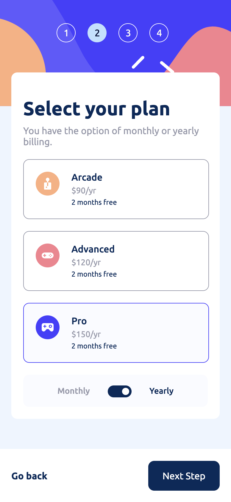

# Multi Step Form

#### This is a milti-step form built with React and Vite

Use the app [here](https://multi-step-form-two-rho.vercel.app)

# Description

See a full list of the features [here](https://github.com/kevmhughes/multi-step-form/blob/main/README.md#users-are-able-to)
 
# Take a Look at the App

## Desktop:
#### Select a plan

## Mobile:

#### Select a plan
<kbd>

</kbd>

# Tools Used

### Development Environment
* Node.js

### Libraries & Frameworks
* React 
* Vite

### Hosting 
* Vercel

# Features

### Users are able to:

* Complete each step of the sequence
* Go back to a previous step to update their selections
* See a summary of their selections on the final step and confirm their order
* View the optimal layout for the interface depending on their device's screen size
* See hover and focus states for all interactive elements on the page
* Receive form validation messages if:
  * A field has been missed
  * The email address is not formatted correctly
  * A step is submitted, but no selection has been made
* See their form data after the session has ended thanks to thier form data being stored in local storage
